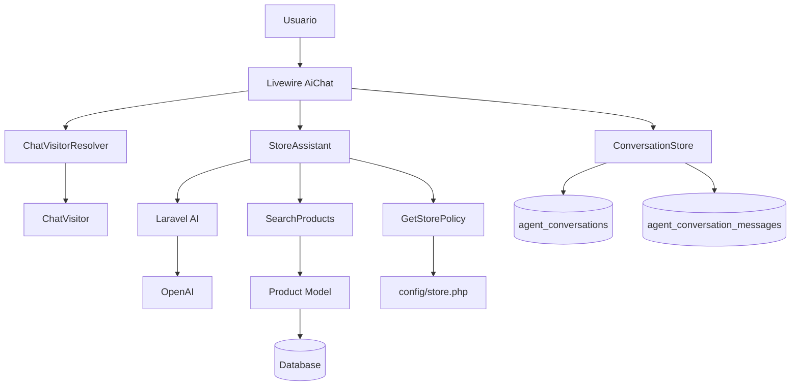

# ShopMate AI — Laravel AI Agents Example

<p align="center">
    <strong>Un asistente conversacional para una tienda de tecnología construido con Laravel AI, OpenAI, Livewire y herramientas personalizadas.</strong>
</p>

<p align="center">
    
    
    
    
    
    
</p>

---

## ¿Qué es ShopMate AI?

**ShopMate AI** es un proyecto educativo que demuestra cómo construir un agente de inteligencia artificial real dentro de una aplicación Laravel utilizando el paquete oficial `laravel/ai`.

El proyecto simula el asistente inteligente de una tienda de tecnología.

A diferencia de un chatbot que simplemente envía preguntas a un modelo de lenguaje, ShopMate puede ejecutar **herramientas dentro de Laravel** para consultar información real de la aplicación.

El agente puede, por ejemplo:

- Buscar productos almacenados en la base de datos.
- Consultar precios.
- Revisar disponibilidad y stock.
- Recomendar productos respetando un presupuesto.
- Consultar políticas de devolución.
- Consultar políticas de envío.
- Consultar información sobre garantías.
- Mantener el contexto de una conversación.
- Separar las conversaciones entre distintos visitantes.
- Evitar que el modelo invente productos o precios que no existen.

El objetivo principal del proyecto es mostrar cómo integrar **agentes de IA con lógica de negocio real en Laravel**.

---

# Características principales

### Agente de IA con Laravel AI

El proyecto utiliza:

```text
laravel/ai
```

para implementar un agente mediante:

```php
App\Ai\Agents\StoreAssistant
```

El agente está configurado actualmente con:

```php
#[Provider(Lab::OpenAI)]
#[Model('gpt-6-luna')]
#[MaxSteps(6)]
#[MaxTokens(800)]
#[Timeout(60)]
```

Esto permite controlar el proveedor, modelo, número máximo de pasos del agente, tokens máximos de respuesta y timeout.

---

## Tool Calling

Una de las partes principales del proyecto es el uso de **tools**.

El modelo de IA no accede directamente a la base de datos.

Cuando necesita información del sistema, Laravel AI puede permitirle ejecutar una herramienta específica.

Actualmente ShopMate posee dos herramientas:

```text
SearchProducts
GetStorePolicy
```

El agente decide cuándo necesita utilizarlas dependiendo de la pregunta realizada por el usuario.

---

# SearchProducts

Ubicación:

```text
app/Ai/Tools/SearchProducts.php
```

Esta herramienta permite al agente consultar el catálogo real de productos almacenados en la base de datos.

Se utiliza cuando el usuario pregunta por:

```text
productos
precios
stock
disponibilidad
recomendaciones
presupuestos
```

Por ejemplo, ante una pregunta como:

```text
Necesito un mouse para trabajar y tengo máximo 60 dólares.
```

el agente puede ejecutar internamente:

```text
SearchProducts

query: mouse
max_price: 60
```

La herramienta realiza una consulta utilizando Eloquent sobre el modelo:

```php
App\Models\Product
```

y busca coincidencias por:

```text
name
category
description
```

También puede aplicar un presupuesto máximo:

```php
price <= max_price
```

Los resultados:

- Solo incluyen productos activos.
- Se ordenan por precio.
- Se limitan a un máximo de 5 resultados.
- Incluyen nombre, categoría, descripción, precio y stock.

El agente tiene instrucciones explícitas para **no inventar productos, precios ni disponibilidad**.

Solo puede recomendar productos devueltos por esta herramienta.

---

# GetStorePolicy

Ubicación:

```text
app/Ai/Tools/GetStorePolicy.php
```

Esta herramienta permite consultar las políticas oficiales de la tienda.

Actualmente soporta:

```text
returns
shipping
warranty
```

Las políticas se encuentran centralizadas en:

```text
config/store.php
```

El agente puede responder preguntas como:

```text
¿Cuál es la política de devoluciones?
```

```text
¿Cuánto tarda el envío?
```

```text
¿Qué garantía tienen los productos?
```

sin necesidad de incluir toda esa información directamente dentro del prompt principal.

---

# Memoria de conversación

ShopMate implementa conversaciones persistentes utilizando las funcionalidades conversacionales de Laravel AI.

El agente implementa:

```php
Conversational
```

y utiliza:

```php
RemembersConversations
```

Esto permite que una conversación pueda continuar manteniendo el contexto anterior.

Por ejemplo:

```text
Usuario:
Necesito un mouse por menos de $60.

ShopMate:
El Logitech M650 cuesta $49.99.

Usuario:
¿Y cuánto stock tiene?
```

El segundo mensaje puede interpretarse dentro del contexto de la conversación anterior.

---

# Conversaciones persistentes

Laravel AI almacena las conversaciones y sus mensajes utilizando:

```text
agent_conversations
agent_conversation_messages
```

Estas tablas guardan información como:

```text
conversation_id
participant
agent
role
content
steps
usage
status
timestamps
```

Gracias a esto, los mensajes pueden recuperarse después de cada interacción con el agente.

---

# Visitantes anónimos

El proyecto no requiere que el usuario cree una cuenta para utilizar el chat.

Cada visitante recibe automáticamente un identificador único.

Esto se gestiona mediante:

```text
App\Services\ChatVisitorResolver
```

y el modelo:

```text
App\Models\ChatVisitor
```

Cuando un visitante abre el chat por primera vez, se genera un:

```text
UUID
```

que se asocia a su sesión.

De esta manera cada visitante posee sus propias conversaciones.

---

# Aislamiento de conversaciones

Antes de continuar o recuperar una conversación, la aplicación comprueba que realmente pertenezca al visitante actual.

Se utiliza:

```php
$store->conversationBelongsTo(...)
```

Esto evita que un visitante pueda reutilizar accidentalmente una conversación perteneciente a otro participante.

El identificador de conversación activo se almacena en sesión mediante:

```text
ai.conversation_id
```

y el visitante mediante:

```text
ai.visitor_id
```

---

# Rate Limiting

El chat incluye protección básica contra abuso.

Cada visitante puede realizar hasta:

```text
10 mensajes por minuto
```

El identificador del rate limit combina:

```text
visitor ID + IP
```

Cada intento permanece registrado durante:

```text
60 segundos
```

Cuando se supera el límite, el usuario recibe el mensaje:

```text
Has enviado demasiados mensajes. Espera un momento e inténtalo de nuevo.
```

---

# Validación de mensajes

Los mensajes enviados al agente deben cumplir:

```text
required
string
max:1000
```

Por lo tanto, cada mensaje puede contener un máximo de:

```text
1000 caracteres
```

---

# Interfaz del chat

La interfaz está construida utilizando:

```text
Laravel Blade
Livewire
Tailwind CSS
```

El componente principal se encuentra en:

```text
app/Livewire/AiChat.php
```

y su vista en:

```text
resources/views/livewire/ai-chat.blade.php
```

La interfaz incluye:

- Chat en tiempo real mediante Livewire.
- Historial de conversación.
- Indicador de carga mientras el agente responde.
- Manejo visual de errores.
- Botón para iniciar una nueva conversación.
- Preguntas sugeridas.
- Diseño responsive.
- Interfaz oscura.
- Estado de procesamiento del agente.

La aplicación principal se encuentra disponible en:

```text
/
```

---

# Arquitectura



---

# Flujo de una conversación

Cuando un usuario escribe:

```text
Necesito un teclado de menos de 100 dólares.
```

el flujo simplificado es:

```text
Usuario
   ↓
Livewire AiChat
   ↓
StoreAssistant
   ↓
Laravel AI
   ↓
El agente interpreta la intención
   ↓
SearchProducts
   ↓
Eloquent / Product
   ↓
Base de datos
   ↓
Productos encontrados
   ↓
StoreAssistant
   ↓
Respuesta final
   ↓
Usuario
```

De esta forma el modelo de IA no necesita conocer previamente el catálogo.

Consulta los datos cuando los necesita.

---

# Base de datos

El proyecto utiliza Eloquent y puede funcionar con bases de datos soportadas por Laravel.

Para esta aplicación se utilizan principalmente las siguientes tablas:

```text
products
chat_visitors
agent_conversations
agent_conversation_messages
```

También se utilizan las tablas estándar necesarias para:

```text
sessions
cache
jobs
```

dependiendo de la configuración seleccionada.

---

# Tabla `products`

La tabla contiene:

| Campo         | Descripción               |
| ------------- | ------------------------- |
| `id`          | Identificador             |
| `name`        | Nombre del producto       |
| `slug`        | Slug único                |
| `category`    | Categoría                 |
| `description` | Descripción               |
| `price`       | Precio                    |
| `stock`       | Existencias               |
| `is_active`   | Indica si puede mostrarse |
| `created_at`  | Fecha de creación         |
| `updated_at`  | Fecha de actualización    |

Solo los productos con:

```text
is_active = true
```

pueden ser utilizados por el asistente.

---

# Productos de demostración

El proyecto incluye un `ProductSeeder` con varios productos ficticios.

| Producto               | Categoría |  Precio |
| ---------------------- | --------- | ------: |
| Logitech M650          | mouse     |  $49.99 |
| Logitech MX Master 3S  | mouse     |  $99.99 |
| Keychron K2            | teclado   |  $89.90 |
| Teclado Mecánico Pro X | teclado   | $129.00 |
| Hub USB-C 8 en 1       | accesorio |  $39.99 |
| Monitor LG 27 IPS      | monitor   | $299.99 |

Estos datos existen únicamente para demostrar cómo un agente puede consultar información real almacenada en una aplicación Laravel.

---

# Políticas de demostración

La aplicación incluye también políticas ficticias para demostrar el uso de tools que no dependen directamente de una tabla.

### Devoluciones

Los productos pueden devolverse dentro de los 30 días posteriores a la compra, siempre que mantengan sus accesorios y no tengan daños provocados por el cliente.

### Envíos

El envío estándar tarda entre 2 y 5 días hábiles.

Los pedidos superiores a $75 incluyen envío estándar gratuito.

### Garantía

Los productos poseen 12 meses de garantía limitada contra defectos de fabricación.

---

# Tecnologías utilizadas

| Tecnología           | Uso                          |
| -------------------- | ---------------------------- |
| PHP 8.3+             | Lenguaje principal           |
| Laravel 13           | Framework backend            |
| Laravel AI 1.1       | Agentes y herramientas de IA |
| OpenAI               | Proveedor del modelo         |
| Livewire 4           | Interfaz reactiva            |
| Blade                | Templates                    |
| Tailwind CSS 4       | Estilos                      |
| Vite 8               | Build de assets              |
| Eloquent ORM         | Acceso a datos               |
| MySQL / SQLite       | Persistencia                 |
| Laravel Sessions     | Sesiones de visitantes       |
| Laravel Rate Limiter | Protección del chat          |

---

# Requisitos

Antes de instalar el proyecto necesitas:

```text
PHP >= 8.3
Composer
Node.js
NPM
MySQL o SQLite
Una API Key de OpenAI
```

Puedes comprobar las versiones con:

```bash
php -v
composer --version
node -v
npm -v
```

---

# Instalación

## 1. Clonar el repositorio

```bash
git clone https://github.com/SoyMauricioDeveloper/Shopmate---Laravel-AI-SDK-Agents-Example.git
```

Entrar al proyecto:

```bash
cd Shopmate---Laravel-AI-SDK-Agents-Example
```

---

## 2. Instalar dependencias de PHP

```bash
composer install
```

---

## 3. Crear el archivo `.env`

En Windows CMD:

```bash
copy .env.example .env
```

En Linux/macOS:

```bash
cp .env.example .env
```

---

## 4. Generar la APP_KEY

```bash
php artisan key:generate
```

---

# Configurar OpenAI

Agrega al archivo:

```text
.env
```

la variable:

```env
OPENAI_API_KEY=tu_api_key
```

Nunca publiques esta clave en GitHub.

El archivo:

```text
.env
```

ya se encuentra excluido mediante `.gitignore`.

---

# Configuración con MySQL

Crea una base de datos:

```sql
CREATE DATABASE shopmate;
```

Luego configura `.env`:

```env
DB_CONNECTION=mysql
DB_HOST=127.0.0.1
DB_PORT=3306
DB_DATABASE=shopmate
DB_USERNAME=root
DB_PASSWORD=
```

Ajusta usuario y contraseña de acuerdo con tu instalación.

---

# Configuración con SQLite

También puedes utilizar SQLite.

Configura:

```env
DB_CONNECTION=sqlite
```

y crea:

```text
database/database.sqlite
```

En Windows PowerShell:

```powershell
New-Item database/database.sqlite -ItemType File
```

En Linux/macOS:

```bash
touch database/database.sqlite
```

Los archivos `.sqlite` dentro de `database/` están excluidos del repositorio.

---

# Ejecutar migraciones

```bash
php artisan migrate
```

Para crear además los productos de demostración:

```bash
php artisan db:seed
```

También puedes realizar ambas operaciones desde cero con:

```bash
php artisan migrate:fresh --seed
```

> `migrate:fresh` elimina las tablas existentes. Úsalo únicamente en entornos de desarrollo.

---

# Instalar dependencias frontend

```bash
npm install
```

Para desarrollo:

```bash
npm run dev
```

Para generar los assets de producción:

```bash
npm run build
```

---

# Ejecutar la aplicación

Puedes iniciar Laravel mediante:

```bash
php artisan serve
```

La aplicación estará disponible normalmente en:

```text
http://127.0.0.1:8000
```

Abre esa dirección en el navegador para acceder a ShopMate AI.

---

# Inicio rápido

Después de configurar `.env`, una instalación típica puede realizarse con:

```bash
composer install
php artisan key:generate
php artisan migrate:fresh --seed
npm install
npm run build
php artisan serve
```

Recuerda configurar previamente:

```env
OPENAI_API_KEY=tu_api_key
```

---

# Ejemplos para probar el agente

### Buscar productos

```text
Necesito un mouse para trabajar.
```

### Presupuesto

```text
Necesito un mouse y tengo máximo 60 dólares.
```

### Buscar un teclado

```text
Busco un teclado por menos de 100 dólares.
```

### Consultar stock

```text
¿Qué monitores tienen disponibles?
```

### Devoluciones

```text
¿Cuál es la política de devoluciones?
```

### Envíos

```text
¿Cuánto tarda el envío?
```

### Garantía

```text
¿Qué garantía tienen los productos?
```

---

# Estructura relevante del proyecto

```text
shopmate/
│
├── app/
│   │
│   ├── Ai/
│   │   ├── Agents/
│   │   │   └── StoreAssistant.php
│   │   │
│   │   └── Tools/
│   │       ├── SearchProducts.php
│   │       └── GetStorePolicy.php
│   │
│   ├── Livewire/
│   │   └── AiChat.php
│   │
│   ├── Models/
│   │   ├── Product.php
│   │   └── ChatVisitor.php
│   │
│   └── Services/
│       └── ChatVisitorResolver.php
│
├── config/
│   ├── ai.php
│   └── store.php
│
├── database/
│   ├── migrations/
│   │   ├── create_agent_conversations_table.php
│   │   ├── create_products_table.php
│   │   └── create_chat_visitors_table.php
│   │
│   └── seeders/
│       ├── DatabaseSeeder.php
│       └── ProductSeeder.php
│
├── resources/
│   └── views/
│       ├── chat.blade.php
│       └── livewire/
│           └── ai-chat.blade.php
│
├── routes/
│   └── web.php
│
├── .env.example
├── composer.json
├── package.json
└── README.md
```

---

# StoreAssistant

El corazón del proyecto es:

```text
app/Ai/Agents/StoreAssistant.php
```

El agente tiene instrucciones para actuar como asistente de una tienda de tecnología.

Entre sus reglas principales están:

```text
Responder siempre en español.
Ser claro y breve.
Utilizar SearchProducts cuando sea necesario.
No inventar productos.
No inventar precios.
No inventar stock.
Respetar exactamente los presupuestos.
Utilizar únicamente información obtenida mediante las tools.
```

El agente registra:

```php
new SearchProducts()
new GetStorePolicy()
```

como herramientas disponibles.

---

# ¿Por qué utilizar Tools?

Un LLM puede generar texto, pero no debería ser considerado por sí mismo una fuente confiable de información sobre los datos internos de una aplicación.

Por ejemplo, si preguntamos:

```text
¿Cuánto cuesta el Logitech M650?
```

el modelo podría conocer precios aproximados encontrados durante su entrenamiento, pero esos datos no necesariamente coinciden con el catálogo de nuestra aplicación.

Con ShopMate:

```text
Pregunta
   ↓
Agente
   ↓
SearchProducts
   ↓
Base de datos
   ↓
Precio real de nuestra aplicación
   ↓
Respuesta
```

Esto permite combinar:

```text
capacidad de razonamiento del modelo
+
datos reales de Laravel
```

que es uno de los conceptos principales detrás de los agentes de IA.

---

# Seguridad

El proyecto incluye algunas medidas básicas importantes.

El archivo:

```text
.env
```

no debe publicarse.

Está incluido dentro de:

```text
.gitignore
```

También están excluidos:

```text
/vendor
/node_modules
.env
.env.production
auth.json
storage/*.key
```

Nunca almacenes una API Key directamente dentro de:

```php
StoreAssistant.php
```

o cualquier archivo que vaya a ser enviado al repositorio.

Utiliza siempre variables de entorno:

```env
OPENAI_API_KEY=
```

---

# Datos ficticios

Este proyecto fue creado con fines:

```text
educativos
demostrativos
experimentales
```

Los productos, stock, precios y políticas incluidos son datos de demostración.

No representan una tienda real.

---

# Objetivo educativo

ShopMate busca mostrar de una manera sencilla cómo pasar de esto:

```text
Usuario
   ↓
LLM
   ↓
Texto
```

a una arquitectura más útil:

```text
Usuario
   ↓
Agente de IA
   ↓
Tools
   ↓
Laravel
   ↓
Base de datos / servicios / lógica de negocio
   ↓
Agente
   ↓
Usuario
```

Este mismo patrón puede utilizarse posteriormente para construir agentes capaces de trabajar con:

```text
inventarios
CRM
ERP
sistemas de soporte
reservaciones
pedidos
facturación
dashboards
APIs externas
bases de datos
automatizaciones
```

sin permitir que el modelo acceda directamente o de manera descontrolada a toda la aplicación.

---

# Autor

Proyecto educativo desarrollado por **Mauricio Developer**.

GitHub:

```text
@SoyMauricioDeveloper
```

Este proyecto forma parte de ejemplos prácticos sobre desarrollo web, Laravel e inteligencia artificial.

---

## Aviso

ShopMate AI es una aplicación de demostración y no debe considerarse una implementación completa para producción sin agregar medidas adicionales de autenticación, autorización, observabilidad, control de costos, pruebas, auditoría y seguridad.
